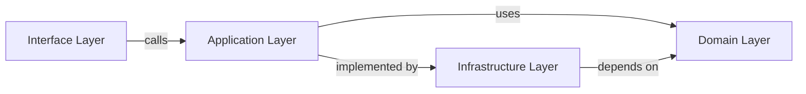

# 🧱 Components

> [Disclaimer](../DISCLAIMER.md)

## 🎯 Objective

This document outlines the role of each main component in the architecture, following Clean Architecture and DDD principles for a food and grocery store.

## 🧩 Layers and Components

### 1. **Interface Layer (Presentation)**

Responsible for handling HTTP requests and mapping them to use cases.

* `views/` (DRF): orchestrates the request and returns a JSON response
* `serializers/`: handles input and output validation, acts as a DTO
* `routers.py` or `urls.py`: defines public endpoints

### 2. **Application Layer**

Contains the orchestration logic of the domain, independent of frameworks or infrastructure.

* `use_cases/`: complete business workflows
* `providers.py`: implementation of use cases for external interfaces

### 3. **Domain Layer**

The core of the system. Pure and independent. Defines business rules.

* `entities/`: Product, Order, Category, User
* `value_objects/`: Price, SKU, Email, Quantity
* `exceptions/`: specific domain errors
* `domain_services/`: complex validations between entities

### 4. **Infrastructure Layer**

Adapters that implement the interfaces defined in the Application Layer.

* `repositories/`: use Django ORM for persistence
* `external_services/`: send emails, process payments, etc.
* `mappers/`: convert ORM models into domain entities

## 🔁 Layer Communication

Each layer depends only on abstractions from the layer directly below it.

## 🧪 Testing

* `Domain`: pure unit tests
* `Application`: integration tests without DB (mocked interfaces)
* `Presentation`: endpoint tests using `APIClient`
* `Infrastructure`: implementation tests with fixtures

## ♻️ Reusable Components

* Logger, Middleware, SlugService, PriceFormatter, SKUGenerator
* Stock management, discount validation, tax calculator

## 🧠 Key Decisions

* No logic in Django models
* Entities do not depend on the ORM
* Repositories only fulfill contracts, no business logic
* Critical validations reside in the domain layer
