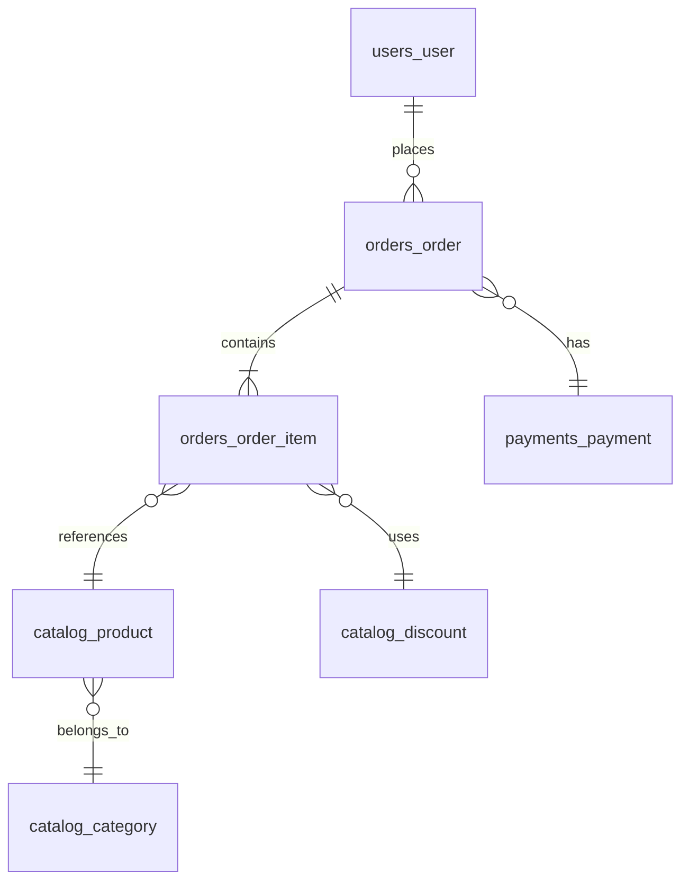

# 🗄️ Database Schema

> [Disclaimer](../DISCLAIMER.md)

## 🧠 Simplified Logical Model

## 🔍 Main Tables

### 🔹 `users_user`

* `id`: UUID (PK)
* `email`: varchar (unique)
* `username`, `first_name`, `last_name`
* `is_active`, `is_admin`

### 🔹 `catalog_product`

* `id`: UUID (PK)
* `name`, `description`
* `sku`: varchar (unique)
* `price`, `stock`, `discount_price`
* `category_id`: FK → `catalog_category`
* `is_active`: bool

### 🔹 `catalog_category`

* `id`: UUID (PK)
* `name`, `slug`
* `parent_id`: FK → self (nullable)

### 🔹 `orders_order`

* `id`: UUID (PK)
* `user_id`: FK → `users_user`
* `status`: enum (pending, paid, shipped, canceled)
* `total_amount`, `created_at`, `updated_at`

### 🔹 `orders_order_item`

* `id`: UUID (PK)
* `order_id`: FK → `orders_order`
* `product_id`: FK → `catalog_product`
* `quantity`, `unit_price`, `total_price`

### 🔹 `payments_payment`

* `id`: UUID (PK)
* `order_id`: FK → `orders_order`
* `status`: enum (pending, paid, failed)
* `payment_method`: string
* `external_reference_id`: string

### 🔹 `catalog_discount`

* `id`: UUID (PK)
* `code`: varchar (unique)
* `percent`: decimal
* `valid_from`, `valid_to`
* `applies_to`: FK → `catalog_category` (nullable)

## 🔐 Constraints

* A product cannot have a discount greater than 100%
* Stock cannot be negative
* Final price must be greater than or equal to 0

## 🧾 Notes

* Entities use `UUID` as primary keys
* Monetary fields use `Decimal(10,2)`
* `SoftDelete` strategy via `is_active` for consistency
* Many-to-Many relationships are handled via explicit intermediate tables
