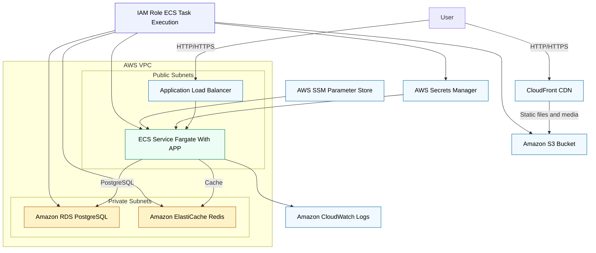

# Objective

- CloudFront + S3 → serve your static and media files through a global CDN.
- Application Load Balancer (ALB) → exposes your application to the public.
- ECS (Fargate) → runs your app in serverless containers.
- RDS (PostgreSQL) → managed relational database.
- ElastiCache (Redis) → cache layer for API endpoints.
- Secrets Manager / Parameter Store → store credentials and configuration (optional).
- IAM Role → grants secure permissions without hard-coded keys.
- CloudWatch → centralized logging and monitoring.
